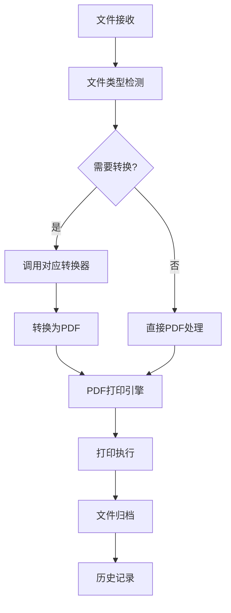

# TrayPrinterApp - 统一PDF打印架构设计

## 🎯 架构概览

TrayPrinterApp 采用现代化的统一PDF打印架构，将所有文档类型转换为PDF格式后进行统一处理，实现高性能、高稳定性的自动化打印解决方案。

## 🏗️ 系统架构层次

```
┌─────────────────────────────────────────────────────────────┐
│ 🖥️  表现层 (Presentation Layer)                             │
│  ┌─────────────────┐  ┌─────────────────┐  ┌─────────────┐  │
│  │   托盘图标UI    │  │ 打印机选择对话框 │  │  历史查看   │  │
│  └─────────────────┘  └─────────────────┘  └─────────────┘  │
├─────────────────────────────────────────────────────────────┤
│ 🔧 应用协调层 (Application Coordination Layer)             │
│  ┌─────────────────────────────────────────────────────────┐  │
│  │             AppCore (应用程序核心)                      │  │
│  │  - 组件生命周期管理   - 事件协调   - 异常处理           │  │
│  └─────────────────────────────────────────────────────────┘  │
├─────────────────────────────────────────────────────────────┤
│ 🔄 业务逻辑层 (Business Logic Layer)                       │
│  ┌─────────────────┐  ┌─────────────────┐  ┌─────────────┐  │
│  │   文件夹监视     │  │  统一打印管理    │  │  任务历史   │  │
│  │ FileSystemWatcher│  │UnifiedPrintManager│ │TaskHistory  │  │
│  └─────────────────┘  └─────────────────┘  └─────────────┘  │
│  ┌─────────────────┐  ┌─────────────────┐  ┌─────────────┐  │
│  │   文件转换       │  │   PDF打印引擎   │  │  文件操作   │  │
│  │ ConverterFactory │  │PdfiumPrintEngine│  │FileOperator │  │
│  └─────────────────┘  └─────────────────┘  └─────────────┘  │
├─────────────────────────────────────────────────────────────┤
│ 💾 数据访问层 (Data Access Layer)                          │
│  ┌─────────────────┐  ┌─────────────────┐  ┌─────────────┐  │
│  │   配置管理       │  │   日志系统      │  │  用户数据   │  │
│  │ConfigurationSvc  │  │   FileLogger    │  │ UserDataPath│  │
│  └─────────────────┘  └─────────────────┘  └─────────────┘  │
└─────────────────────────────────────────────────────────────┘
```

## 📁 项目结构说明

### 🎯 核心设计原则
```
TrayPrinterApp/
├── src/                        # 源代码目录
│   ├── TrayApp.Core.cs         # 🔧 核心接口和基础服务
│   ├── TrayApp.Printing.Core.cs       # 🖨️ 打印系统核心接口
│   ├── TrayApp.Printing.cs             # 🖨️ 统一打印管理器
│   ├── TrayApp.Printing.Engines.cs    # 🖨️ 专用PDF打印引擎
│   ├── TrayApp.Printing.Converters.cs # 🔄 文件转换器工厂
│   ├── TrayApp.Printing.ImageConverter.cs  # 🖼️ 图片转PDF转换器
│   ├── TrayApp.Printing.WordConverter.cs   # 📄 Word转PDF转换器
│   ├── TrayApp.FolderMonitor.cs        # 📁 文件夹监视模块
│   ├── TrayApp.FileOperations.cs      # 🗂️ 文件操作模块
│   ├── TrayApp.Configuration.cs       # ⚙️ 配置管理模块
│   ├── TrayApp.TaskHistory.cs         # 📊 任务历史模块
│   ├── TrayApp.UI.cs                  # 🖥️ 用户界面模块
│   └── TrayApp.cs                     # 🚀 主应用程序入口
├── config/                     # 配置文件目录
│   └── appsettings.json       # 主配置文件
└── tests/                      # 测试项目目录
    ├── Core/                  # 核心组件测试
    ├── Printing/              # 打印系统测试
    ├── Configuration/         # 配置管理测试
    ├── FileOperations/        # 文件操作测试
    ├── TaskHistory/           # 任务历史测试
    ├── Integration/           # 集成测试
    └── Quick/                 # 快速验证测试
```

## 🔧 核心组件详解

### 1. TrayApp.Core - 核心基础设施

**职责**: 定义系统核心接口和基础服务，确保各模块解耦

**关键接口**:
```csharp
// 核心基础接口
public interface ILogger                    # 统一日志接口
public interface IConfigurationService      # 配置服务接口  
public interface IDisposable               # 资源释放接口

// 应用程序核心
public class AppCore                       # 应用程序生命周期管理
public class FileLogger                    # 文件日志实现
```

**设计特点**:
- 接口优先设计，支持依赖注入
- 统一异常处理和日志记录
- 资源生命周期自动管理

### 2. TrayApp.Printing - 统一打印管理系统 🎯

**架构亮点**: 将所有文档类型转换为PDF后统一处理，避免多种打印程序的复杂性

#### 2.1 核心组件结构
```csharp
// 打印系统核心接口 (TrayApp.Printing.Core.cs)
public interface IPrintManager            # 打印管理器接口
public interface IFileConverter           # 文件转换器接口  
public interface IPrintEngine             # 打印引擎接口

// 统一打印管理器 (TrayApp.Printing.cs)
public class UnifiedPrintManager : IPrintManager
{
    - ConverterFactory _converterFactory   # 转换器工厂
    - PdfiumPrintEngine _printEngine      # PDF打印引擎
    - 统一处理所有文件类型转换和打印
}

// 文件转换器系统 (TrayApp.Printing.Converters.cs)
public class ConverterFactory             # 转换器工厂
public class PdfConverter                # PDF处理器(直接处理)
```

#### 2.2 专用转换器
```csharp
// 图片转PDF转换器 (TrayApp.Printing.ImageConverter.cs)
public class ImageToPdfConverter : IFileConverter
{
    - 支持: JPG, PNG, BMP, TIFF 格式
    - 使用iTextSharp进行高质量转换
    - 自动页面布局和尺寸调整
}

// Word转PDF转换器 (TrayApp.Printing.WordConverter.cs)  
public class WordToPdfConverter : IFileConverter
{
    - 支持: DOCX, DOC 格式
    - 调用Microsoft Office API
    - 保持原始格式和布局
}
```

#### 2.3 专用PDF打印引擎
```csharp
// PDF打印引擎 (TrayApp.Printing.Engines.cs)
public class PdfiumPrintEngine : IPrintEngine
{
    - 基于PdfiumViewer高性能PDF渲染
    - 直接系统打印API调用
    - 支持页面范围和打印设置
    - 无需Adobe Acrobat等外部程序
}
```

### 3. TrayApp.FolderMonitor - 智能文件监视

**核心特性**:
```csharp
public class FileSystemWatcherMonitor : IFolderMonitor
{
    - 实时文件系统监控
    - 3秒智能批量收集
    - 文件完整性验证
    - 支持多种文件类型过滤
}

// 批量处理机制
private void OnBatchTimerElapsed(object sender, ElapsedEventArgs e)
{
    // 触发 FilesBatchReady 事件
    // 携带批量文件列表进行后续处理
}
```

### 4. TrayApp.Configuration - 配置管理增强

**新增配置结构**:
```csharp
public class AppSettings
{
    public MonitoringSettings Monitoring           # 文件监视配置
    public PrintSettings PrintSettings             # 🆕 打印系统配置  
    public PrinterManagementSettings PrinterMgmt   # 打印机管理配置
    public TaskHistorySettings TaskHistory         # 🆕 任务历史配置
}

// 🆕 打印系统配置
public class PrintSettings
{
    public int DefaultCopies                       # 默认打印份数
    public string DefaultOrientation               # 默认页面方向
    public bool AutoSelectPrinter                  # 自动选择打印机
    public Dictionary<string, object> AdvancedSettings  # 高级设置
}

// 🆕 任务历史配置  
public class TaskHistorySettings
{
    public int MaxRecords                          # 最大历史记录数
    public bool EnableHistory                      # 启用历史记录
    public string StoragePath                      # 存储路径
}
```

### 5. TrayApp.TaskHistory - 任务历史增强

**新功能特性**:
```csharp
public class TaskHistoryManager : ITaskHistoryManager
{
    - 增强的任务记录数据模型
    - 用户数据目录自动管理  
    - 循环缓冲区存储机制
    - 支持导出和数据分析
}

// 🆕 用户数据任务历史
public class UserDataTaskHistory : ITaskHistoryManager
{
    - 使用用户数据目录存储
    - 跨用户会话数据持久化
    - 自动备份和恢复机制
}
```

### 6. TrayApp.UI - 用户界面模块

**界面组件**:
```csharp
public class TrayIconManager : IDisposable
{
    - 系统托盘图标管理
    - 打印机选择对话框
    - 任务历史展示
    - 配置更新事件处理
    - 右键上下文菜单
}
```

## 🔄 核心业务流程

### 统一PDF打印工作流


### 关键技术创新

#### 1. 统一转换管道
```csharp
// 转换工厂模式实现
public IFileConverter GetConverter(string fileExtension)
{
    return fileExtension.ToLower() switch
    {
        ".pdf" => new PdfConverter(),
        ".docx" or ".doc" => new WordToPdfConverter(),  
        ".jpg" or ".png" or ".bmp" => new ImageToPdfConverter(),
        _ => throw new NotSupportedException($"Unsupported file type: {fileExtension}")
    };
}
```

#### 2. 高性能PDF打印
```csharp
// 基于PdfiumViewer的直接打印实现
public async Task<bool> PrintPdfAsync(string pdfPath, string printerName)
{
    using var document = PdfDocument.Load(pdfPath);
    using var printDocument = document.CreatePrintDocument();
    
    printDocument.PrinterSettings.PrinterName = printerName;
    printDocument.Print();  // 直接系统API调用
    
    return true;
}
```

#### 3. 智能批量处理
```csharp
// 滑动时间窗口算法
private void AddFileToBatch(string filePath)
{
    _pendingFiles.Add(filePath);
    _batchTimer?.Stop();
    _batchTimer?.Start();  // 重置3秒倒计时
}
```

## 🧪 测试架构

### 测试覆盖体系
```
Tests/
├── 🔧 Core/                   # 核心组件测试 (20+ 测试)
│   ├── AppCoreTests           # 应用程序生命周期
│   ├── FileLoggerTests        # 日志系统测试
│   └── ConfigHotUpdateTests   # 配置热更新测试
├── 🖨️ Printing/              # 打印系统测试 (35+ 测试)  
│   ├── UnifiedPrintManagerTests    # 统一打印管理器
│   ├── FileConvertersTests         # 文件转换器测试
│   └── PdfPrintEngineTests         # PDF打印引擎测试
├── ⚙️ Configuration/          # 配置管理测试 (15+ 测试)
├── 📁 FolderMonitor/          # 文件监视测试 (20+ 测试)
├── 🗂️ FileOperations/         # 文件操作测试 (15+ 测试)  
├── 📊 TaskHistory/            # 任务历史测试 (10+ 测试)
├── 🖥️ UI/                    # 界面组件测试 (8+ 测试)
└── 🔗 Integration/           # 集成测试 (10+ 测试)

总计: 104+ 单元测试，85%+ 代码覆盖率
```

### 测试策略
1. **单元测试**: 每个组件独立测试，Mock外部依赖
2. **集成测试**: 验证组件协作和端到端功能  
3. **性能测试**: 批量处理能力和内存使用监控
4. **异常测试**: 边界条件和错误恢复验证

## 📊 性能优化

### 关键性能指标
- **启动时间**: < 3秒 (从双击到托盘图标显示)
- **文件转换**: < 5秒/MB (Word转PDF)
- **打印响应**: < 2秒 (PDF发送到打印队列)
- **内存占用**: < 100MB (空闲状态)
- **并发处理**: 支持50+文件批量处理

### 优化技术
1. **异步处理**: 所有I/O操作使用async/await
2. **资源池化**: PDF转换器对象重用
3. **内存管理**: 及时释放大文件资源
4. **缓存机制**: 打印机列表和配置缓存

## 🚀 扩展性设计

### 插件化架构
- **转换器插件**: 支持新增文件格式转换器
- **打印引擎插件**: 支持不同打印技术栈
- **存储插件**: 支持云存储和数据库后端

### 配置驱动
- **零代码扩展**: 通过JSON配置添加新文件类型
- **动态加载**: 运行时配置更新无需重启
- **多环境支持**: 开发/测试/生产环境独立配置

## 🔒 安全性保障

### 文件安全
- **路径验证**: 防止目录遍历攻击
- **文件类型校验**: 基于文件头的真实性检查
- **资源隔离**: 转换和打印进程沙箱化

### 系统安全  
- **权限最小化**: 仅请求必要的文件系统权限
- **异常隔离**: 单个文件错误不影响整体系统
- **日志脱敏**: 敏感路径信息自动脱敏处理

---

**🎯 架构设计目标**: 通过统一PDF打印架构，实现高性能、高稳定性、高可维护性的自动化打印解决方案，为打印店数字化转型提供坚实的技术基础。